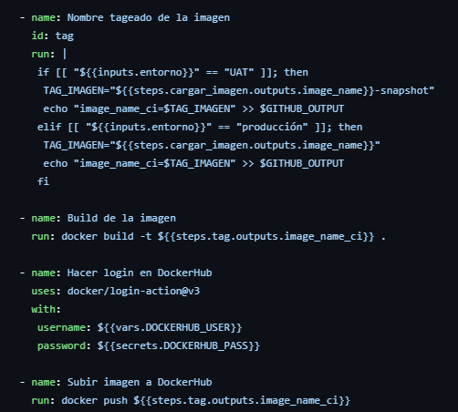
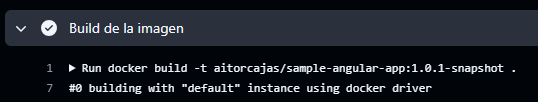
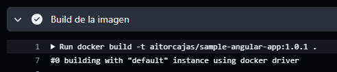

Para hacer el ejercicio he aprovechado el código que tenía que diferenciaba entre entornos dependiendo si la rama era main o development, entonces al llamar al action he añadido una condición como la que tengo en el fichero environment.yml para agrear `-snapshot` a la etiqueta de la imagen o no.

 
Push en `development` :

 
Push en `main` :

